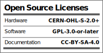

# @REPOSITORY_NAME@

### LICENSES

- All firmware (unless otherwise noted), [is licensed under GPL-3.0 or any later version](https://www.gnu.org/licenses/gpl.html)
- All hardware is [licensed under CERN-OHL-S v2 or any later version](https://ohwr.org/cern_ohl_s_v2)

